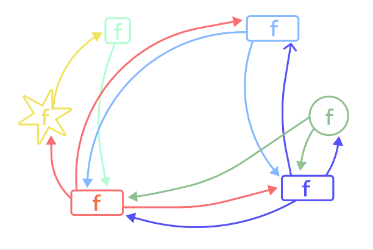

# Объектно-ориентированное программирование

1. [Введение](#title)
2. [Зачем нужно ООП](#title1)
3. [Структура ООП](#title2)
   1. [Объекты и классы](#title3)
   2. [Атрибуты и методы](#title4)
   3. [Принципы ООП](#title5)
      1. [Абстракция](#title6)
      2. [Инкапсуляция](#title7)
      3. [Наследование](#title8)
      4. [Полиморфизм](#title9)
4. [Преимущества ООП](#title10)
   1. [Модульность](#title11)
   2. [Гибкость](#title12)
   3. [Экономия времени](#title13)
   4. [Безопасность](#title14)
5. [Недостатки ООП](#title15)
   1. [Сложный старт](#title16)
   2. [Снижение производительности](#title17)
   3. [Большой размер программы](#title18)
6. [План по изучению ООП на языке PHP](#plan)

---

### <a id="title">Введение</a>

**Объектно-ориентированное программирование (ООП)** - это парадигма программирования, 
которая позволяет организовать код в виде объектов, которые взаимодействуют между собой. 
`ООП` основано на трех основных концепциях: инкапсуляции, наследования и полиморфизма.

- `Инкапсуляция` позволяет объединить данные и методы, которые с ними работают, в классы. 
Класс - это абстрактный шаблон, по которому создаются объекты. Данные объекта хранятся в полях класса, 
а методы определяют его поведение. 
- `Наследование` позволяет создавать иерархию классов, где производные классы наследуют свойства и 
методы базового класса. Это позволяет повторно использовать код и создавать иерархии объектов
с различными уровнями специализации. 
- `Полиморфизм` позволяет использовать методы базового класса для работы с объектами производных классов. 
Это означает, что можно вызывать один и тот же метод на разных объектах и получать различные результаты в 
зависимости от типа объекта.

ООП широко применяется в различных языках программирования, таких как `Java`, `C++`, `Python`, `PHP` и других. 
Парадигма ООП позволяет создавать модульный, гибкий и расширяемый код, упрощает разработку
и поддержку программного обеспечения.

Идеология объектно-ориентированного программирования (ООП) разрабатывалась, 
чтобы связать поведение определенного объекта с его классом. 
Людям проще воспринимать окружающий мир как объекты, которые поддаются определенной классификации 
(например, разделение на живую и неживую природу). 

---

### <a id="title1">Зачем нужно ООП</a>

До ООП в разработке использовался другой подход — `процедурный`. 
Программа представляется в нем как набор процедур и функций — подпрограмм, которые выполняют определенный блок кода 
с нужными входящими данными. Процедурное программирование хорошо подходит для легких программ без сложной структуры. 
Но если блоки кода большие, а функций сотни, придется редактировать каждую из них, продумывать новую логику. 
В результате может образоваться много плохо читаемого, перемешанного кода — `«спагетти-кода»` или `«лапши»`.

Пример "Спагетти-кода": 

В отличие от процедурного, объектно-ориентированное программирование позволяет вносить изменения один раз — в объект.
Именно он — ключевой элемент программы. Все операции представляются как взаимодействие между объектами. 
При этом код более читаемый и понятный, программа проще масштабируется.

Объектно-ориентированное программирование используется, чтобы:

- структурировать информацию и не допускать путаницы;
- точно определять взаимодействие одних элементов с другими;
- повышать управляемость программы;
- быстрее масштабировать код под различные задачи;
- лучше понимать написанное;
- эффективнее поддерживать готовые программы;
- внедрять изменения без необходимости переписывать весь код.

---

## <a id="title2">Структура ООП</a>

### <a id="title3">Объекты и классы</a>

Чтобы сделать код проще, программу разбивают на независимые блоки — объекты. 
В реальной жизни это может быть стол, чашка, человек, книга, здание и многое другое. 
В программировании объекты — это структуры данных: пользователь, кнопка, сообщение. 
У них, как и у реальных предметов, могут быть свойства: цвет, содержание или имя пользователя. 
А чтобы объединить между собой объекты с похожими свойствами, существуют классы.

**Класс** — это «шаблон» для объекта, который описывает его свойства. Несколько похожих между собой объектов, 
например профили разных пользователей, будут иметь одинаковую структуру, а значит, принадлежать к одному классу. 
Каждый объект — это экземпляр какого-нибудь класса.

Понять, что такое ООП, поможет аналогия.

- Понятие «программист» — это класс.
- Конкретный разработчик по имени Дима — это объект, принадлежащий к классу «программист» (экземпляр класса).
- Зарплата, рабочие обязанности, изученные технологии и должность в компании — это свойства,
которые есть у всех объектов класса «программист», в том числе у Дмитрия. 
У разных объектов свойства различаются: зарплата и обязанности Дмитрия будут отличаться от таковых
у другого разработчика Миши.

### <a id="title4">Атрибуты и методы</a>

Объект — это набор переменных и функций, как в традиционном функциональном программировании. 
Переменные и функции и есть его свойства.

- **Атрибуты** — это переменные, конкретные характеристики объекта, такие как цвет поля или имя пользователя.
- **Методы** — это функции, которые описаны внутри объекта или класса. Они относятся к определенному объекту 
и позволяют взаимодействовать с ними или другими частями кода.

Объект, класс, атрибуты и методы в ООП на примере

### <a id="title5">Принципы ООП</a>

Объектно-ориентированное программирование определяют через четыре принципа, по которым можно понять основы работы.
Иногда количество сокращают до трех — опускают понятие абстракции.

#### <a id="title6">Абстракция</a>

**Абстрагирование** — это способ выделить набор наиболее важных атрибутов и методов и исключить незначимые. 
Соответственно, абстракция — это использование всех таких характеристик для описания объекта. 
Важно представить объект минимальным набором полей и методов без ущерба для решаемой задачи.

Пример: объекту класса «программист» вряд ли понадобятся свойства «умение готовить еду» или «любимый цвет». 
Они не влияют на его особенности как программиста. 
А вот «основной язык программирования» и «рабочие навыки» — важные свойства, без которых программиста не опишешь.

Набор атрибутов и методов, доступный извне, работает как интерфейс для доступа к объекту. Через них к нему могут 
обращаться другие структуры данных, причем им не обязательно знать, как именно объект устроен внутри.

#### <a id="title7">Инкапсуляция</a>

Каждый объект — независимая структура. Все, что ему нужно для работы, уже есть у него внутри. 
Если он пользуется какой-то переменной, она будет описана в теле объекта, а не снаружи в коде. 
Это делает объекты более гибкими. Даже если внешний код перепишут, логика работы не изменится.

Инкапсуляция помогает с легкостью управлять кодом. 
Выше мы сказали, что для обращения к объекту не нужно понимать, как работают его методы. 
Начальнику разработчика Дмитрия не обязательно знать, как именно он программирует:
главное — чтобы выполнялись поставленные задачи.

Внутреннее устройство одного объекта закрыто от других: 
извне «видны» только значения атрибутов и результаты выполнения методов.

#### <a id="title8">Наследование</a>

Можно создавать классы и объекты, которые похожи друг на друга, но немного отличаются — 
имеют дополнительные атрибуты и методы. 
Более общее понятие в таком случае становится «родителем», а более специфичное и подробное — «наследником».

Упомянутый программист Дима — это человек. 
Но «человек» — более общее определение, которое не описывает свойства, важные именно для программиста. 
Можно сказать, что класс «программист» унаследован от класса «человек»: программист тоже является человеком, 
но у него есть дополнительные свойства.

В таком случае разработчик Дима будет и человеком, и программистом одновременно. 
У него будут наборы свойств от обоих классов.

У одного «родителя» может быть несколько дочерних структур. 
Например, от «человека» можно наследовать не только «программиста», но и «директора».

Одиночное и множественное наследие:

Наследование позволяет реализовывать сложные схемы с четкой иерархией «от общего к частному». 
Это облегчает понимание и масштабирование кода. Не нужно много раз переписывать в разных объектах одни и те же свойства. 
Достаточно унаследовать эти объекты от одного «родителя», и «родительские» свойства применятся автоматически.

#### <a id="title9">Полиморфизм</a>

Одинаковые методы разных объектов могут выполнять задачи разными способами. 
Например, у «человека» есть метод «работать». 
У «программиста» реализация этого метода будет означать написание кода,
а у «директора» — рассмотрение управленческих вопросов. Но глобально и то, и другое будет работой.

Тут важны единый подход и договоренности между специалистами. 
Если метод называется delete, то он должен что-то удалять. 
Как именно — зависит от объекта, но заниматься такой метод должен именно удалением. 
Более того: если оговорено, что «удаляющий» метод называется delete,
то не нужно для какого-то объекта называть его remove или иначе. Это вносит путаницу в код.

---

## <a id="title10">Преимущества ООП</a>

### <a id="title11">Модульность</a>

Объектно-ориентированный подход позволяет сделать код более структурированным, 
в нем легко разобраться стороннему человеку. 
Благодаря инкапсуляции объектов уменьшается количество ошибок и ускоряется разработка с участием
большого количества программистов, потому что каждый может работать независимо друг от друга.

### <a id="title12">Гибкость</a>

ООП-код легко развивать, дополнять и изменять. Это обеспечивает независимая модульная структура. 
Взаимодействие с объектами, а не логикой упрощает понимание кода. 
Для модификации не нужно погружаться в то, как построено ПО. 
Благодаря полиморфизму можно быстро адаптировать код под требования задачи, не описывая новые объекты и функции.

### <a id="title13">Экономия времени</a>

Благодаря абстракции, полиморфизму и наследованию можно не писать один и тот же код много раз. 
Это ускоряет разработку нового ПО. Интерфейсы и классы в ООП могут легко преобразовываться в подобие библиотек, 
которые можно использовать заново в новых проектах. Также ООП экономит время при поддержке и доработке приложения.

### <a id="title14">Безопасность</a>

Программу сложно сломать, так как инкапсулированный код недоступен извне.

---

## <a id="title15">Недостатки ООП</a>

### <a id="title16">Сложный старт</a>

Чтобы пользоваться ООП, нужно сначала изучить теорию и освоить процедурный подход, поэтому порог входа высокий.

### <a id="title17">Снижение производительности</a>

Объектно-ориентированный подход немного снижает производительность кода в целом. 
Программы работают несколько медленнее из-за особенностей доступа к данным и большого количества сущностей.

### <a id="title18">Большой размер программы</a>

Код, написанный с использованием ООП, обычно длиннее и занимает больше места на диске, чем «процедурный». 
Это происходит, потому что в такой программе хранится больше конструкций, чем в обычном процедурном скрипте.

---

### <a id="plan">План по изучению ООП на языке PHP</a>

1. Понимание основной концепции ООП: начните с изучения основных понятий, таких как классы, 
объекты, методы, свойства и конструкторы. Узнайте, как создавать классы и объекты в PHP.
2. Инкапсуляция: изучите, как организовать данные и методы в классе, чтобы достичь инкапсуляции. 
Узнайте о модификаторах доступа, таких как public, private и protected, и их влиянии на доступ к свойствам и методам класса.
3. Наследование: изучите, как создавать иерархию классов в PHP с помощью наследования. 
Узнайте, как использовать ключевое слово "extends" для наследования свойств и методов от базового класса. 
При изучении наследования обратите внимание на понятия переопределения методов и вызова методов родительского класса.
4. Полиморфизм: изучите, как использовать полиморфизм в PHP. 
Узнайте, как создавать абстрактные классы и интерфейсы для определения общего поведения для различных классов. 
При изучении полиморфизма обратите внимание на возможность создания экземпляров объектов через интерфейсы 
и использование полиморфных вызовов методов.
5. Применение ООП: практикуйтесь в создании различных классов и объектов, реализуя различные сценарии. 
Работайте с наследованием, полиморфизмом и инкапсуляцией, чтобы создавать гибкий и модульный код. 
Решайте задачи, которые помогут вам применить полученные знания на практике.
6. Изучение расширенных концепций: если вы ощущаете, что основы ООП на PHP освоены, 
вы можете изучить более расширенные концепции, такие как интерфейсы, трейты, магические методы и пространства имен. 
Это поможет вам создавать более сложные и продвинутые приложения.
7. Обучение на практике: создавайте собственные проекты на PHP, применяя знания ООП. 
Это поможет вам закрепить усвоенные концепции и развить навыки программирования на языке PHP.
8. Работа с наследованием и интерфейсами: изучите, как использовать наследование и интерфейсы вместе для 
создания гибкой системы классов. 
Узнайте, как классы могут наследовать как другие классы, так и реализовывать интерфейсы одновременно. 
Это позволит вам создавать классы, которые имеют общую функциональность, но также могут быть изменены 
и расширены по разным направлениям.
9. Обработка ошибок и исключения: изучите, как обрабатывать ошибки и исключения в ООП-программировании на PHP. 
Узнайте о различных видах исключений, которые могут возникнуть, и обработке их с помощью конструкции try-catch. 
Изучите, как создавать собственные исключения для обработки специфических ситуаций в своих программах.
10. Рефакторинг и тестирование: при разработке ООП-приложений важно уделять внимание рефакторингу, 
чтобы улучшить структуру и эффективность кода. Изучите различные приемы рефакторинга, такие как вынос методов, 
объединение классов, разделение классов и т. д. 
Также изучите базовые принципы тестирования, чтобы проверить работоспособность ваших классов и объектов.
11. Продолжайте учиться и практиковаться: ООП - это глубокая и обширная тема, которая требует постоянного изучения и практики. 
Постоянно осваивайте новые концепции и подходы, и применяйте их в своих проектах. 
Общайтесь с другими разработчиками, изучайте передовой опыт и ищите новые способы применения ООП в своих программах.

